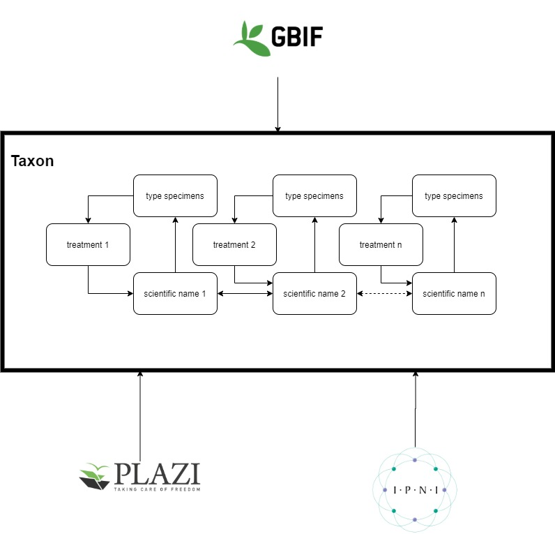
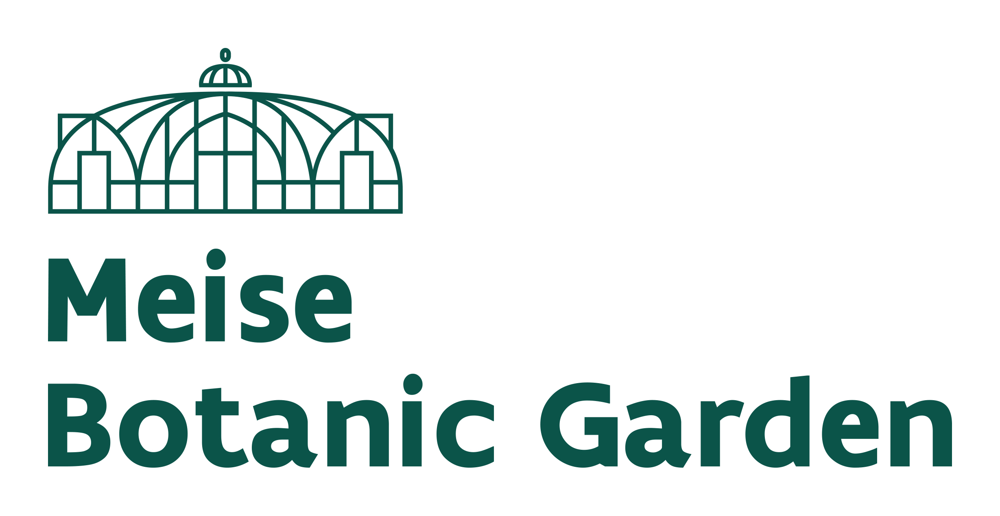

# Linking nomenclature to type specimens
Maarten Trekels - Meise Botanic Garden

## Introduction
One of the first jobs a taxonomist must do when revising a taxon is to find and examine the nomenclatural type material for the taxa they are researching. Nomenclatural types, together with the formal protologue, link a name to a taxon and so provide important evidence of the species concept. However, type specimens can be hard to find, they may not be labelled as types, they can be scattered across numerous collections and are variously mislabelled. Tools to streamline the searching for types would reduce the workload for taxonomists and help them to concentrate on the biological aspects of the species concept.
The international codes for biological nomenclature clearly state the rules for type specimens. For example, there should only be one holotype, lectotype or neotype, and all plant type material should be collected at the same gathering. Furthermore, even though type specimens are some of the most important specimens in a collection their associated data can be wrong, or nomenclatural decisions in the past may have been made in error. These rules are testable, but only if you can find the specimens.
These scripts help taxonomists find type material on GBIF and link them to the original protologues on Treatment Bank. It also uses the International Plant Names Index and Plants of the World online (http://www.plantsoftheworldonline.org/) to discover synonyms.
In this package of scripts, we focus on botanical specimens and treatments. However the principles can be expanded to any kind of organism where the codes of nomenclature require a type specimen.

## Methodology
### Getting all the building blocks
In order to reconstruct the information on a scientific name, we use the different available APIs
* GBIF API: nomenclatural type specimens and other related specimens
* PLAZI SPARQL endpoint: to retrieve information on the scientific name from the protologue, get the collection identifiers
* Index Herbariorum: from the collection identifiers, look for the collections mentioned in the protologue
* IPNI/POWO: to look for synonyms. Integration of their services is done through the PyKew Python package [3].

### Workflow


The application expects, as an input, the taxon name (genus + epithet). Based on those two parameters, a number of steps gather the information:

#### Step 1: search for the type specimen in GBIF

Using the genus and epithet, the application looks for the taxon key using the GBIF API (GBIF taxonomic backbone). Based on the taxon key, all type specimen with that key are retrieved. Since the first version of this application is focussing on the botanical use-case, only 'Holotype', 'Isotype', 'Paratype', 'Syntype', 'Lectotype', 'Isolectotype', 'Neotype', 'Isoneotype', 'Epitype' and 'Type' are considered as type status.

By plotting the holotype specimens on a timeline, it is possible to display the time evolution of the species naming.

#### Step 2: get information from the treatments

The SPARQL endpoint of the Plazi Treatment Bank allows searching on dwc:genus and dwc:species (i.e. the epithet). As a result from the query, the defining and augmenting treatments can be retrieved. Using the persistent identifier of the treatment, a request can be performed to get the content of the treatment.
From this, the date of publication can be retrieved. By parsing the paragraph of the treatment that refers to the type specimens, the holding collections can be found (using the Index Herbariorum API).
To have a complete overview on the treatments, the same search is performed on the different synonyms of a taxon. This is achieved by using the IPNI and POWO databases, to derive a list of synonyms.

#### Step 3: nomenclatural rules

Apply the rules of nomenclature that are defined in the next section.

#### Step 4: find related specimens

Based on the date, taxon and collector of the specimens that are already found, a search using the GBIF API is done to build a list of possible related specimen.

### Rules of nomenclature
The rules of nomenclature are defined in `scripts\rules_nomenclature.py`. In this version of the application, the focus is solely on botany. This is the first set of functions to be adapted when expanding to other branches of biology.

The current rules that are implemented are:
* For each name there should be only one holotype
* TO DO: if date of treatment known: check date specimen (only possible with defining treatments)
* isotypes should have the same date
* check dates of the paratypes (less than or equal)
* if there is a lectotype: neither a holotype nor neotype should exist
* lectotype should exist at the time of first description (rule to be defined)
* look for related specimens. 


### Visualisation
The set of scripts that implement the functionalities serve a Python Flask web application. The only parameters that need to be given to the application are the Genus and epithet. An html page is generated from the different scripts. The specimens and treatments are shown (with pictures if available). As well as a table with the checks on the nomenclatural rules.

## Recommendations
### Unique identifiers for collections
In order to find the holding collection of the type specimen, Index Herbariorum needs to be used. The letter code is unique for herbaria, but not for collections. In order to extend the application beyond botany, a unique identifier for each collection is needed. These unique identifiers should be linked to the relevant type specimens and treatments.
In order to have a better interlinking between them, these unique identifiers (e.g. GrSciColl identifiers) should be used by the scientist to refer to collections.

### Enrichment of collections data
This application is a demonstration on how collection data can be enriched with information on the different taxa. By linking type specimens to names and treatments, a more complete overview on a taxon is created.
Some relative easy ways to enrich the data are:
* Collections could link type specimens to the relevant Plazi IDs
* Linking the name under which a specimen is filed with a taxonomic ID (GBIF taxonKey or IPNI ID)

### Discovering hidden treasures
The application is demonstrating the power of discovering (possible) mistakes in the naming of specimen (by implementing a few simple nomenclatural rules). Apart from that, some type specimens are not flagged as being a type. As such, they are missing in the complete overview of a taxon. By looking at specimens that are possibly related to already known type specimen, it is possible to discover type specimens in the collections. 


## Improvements of the application
This is a first version of the application, and many improvements and extentions can be imagined. Some possible ideas are:
* Implement a logic to take the liste of 'Type' specimen and discover the kind of type the specimen could/should be
* The interface with the Biodiversity Heritage Library (BHL) is implemented in the scripts, but is not yet integrated in the application
* Better integration of the information that can be extracted from Wikidata
* Improve the search for related specimens
* Output of the application in JSON/JSON-LD

### Special cases discovered
When testing the scripts, a special case was discovered. For 'Fallopia japonica' and 'Reynoutria japonica' (synonyms), the `genusKey` and `speciesKey` are the same, but on GBIF they seem to have a different `taxonKey`. This case is not catched by the application.

## Structure of the repository

The repository contains two main folders. The 'notebooks' folder is a selection of Jupyter notebooks that were used to explore the possibilities with the different APIs and how this information can be extracted.

The real code is contained in the 'linkedTaxonomy' folder. This folder contains a python Flask application. The application takes Genus and epithet as input to run the checks on nomenclature and build the information known on this taxon. A timeline is built to show the history of this taxon.

```bash
|-- requirements.txt
|-- LICENSE
|-- README.md
|-- notebooks
    |-- Name_information_types.ipynb
    |-- Types_GBIFonly.ipynb
    |-- Wikidata_taxon.ipynb
|-- linkedTaxonomy
    |-- app.py
    |-- static
        |-- images
    |-- scripts
        |-- bhl_results.py
        |-- index.py
        |-- lt_html.py
        |-- plazi.py
        |-- protologue.py
        |-- rules_nomenclature.py
        |-- type_specimen.py
        |-- wikidata.py
    |-- templates
        |-- home.html
        |-- taxon.html
 ```

## Installation and usage instructions

### Jupyter/Google Colab notebooks
Some of the development of this application was performed in Jupyter notebooks. While all of the functionalities in these notebooks are transferred to the Python application, you might find it useful to have a look at these notebooks and play around with them. Be aware that not


### Installation
Make sure that Python >= 3.6 is installed on your machine. In order to install the necessary dependencies, please run in the main folder:

```bash
pip3 install -r requirements.txt
```

In order to start the application, go to the folder `\linkedTaxonomy` and run:

```bash 
python3 app.py
```
This will start a development server running on `http://localhost:5000`. In order to deploy this application on a server, you should setup a WSGI interface and a server (e.g. Apache)

### Usage of the application
The home page of the application gives you a list of possible taxa extracted from Wikidata. This list is created by the following rule: all taxa with an IPNI ID and a Plazi ID. An extra filter is applied which excludes results with a ZooBank ID, since these treatments are often not accessible. The names are clickable and start the actual application. However, the application works for other taxa as well.

To start the actual appliction, the structure of the URL to pass is:
```
http://localhost:5000/<Genus>/<epithet>
```
Careful: the syntax is case sensitive. The genus should always start with a capital.


## Acknowledgements
During the time I spend on creating this application, I’m grateful to the many fruitful discussions that let to the current prototype. In particular, I want to mention here the collaborations on linked data and standards development within the Synthesys+ project (especially within Networking Action 4) [4]. Part of the idea of this application originated from a Wikidata workshop at the COST MOBILISE meeting held in Warsaw (February 2020) [5, 6]. I want to thank the organizers for creating an inspiring environment. And last and not least, I want to thank all colleagues at Meise Botanic Garden for their contributions. In particular the biodiversity informatics team (Pieter Huybrechts, Mathias Dillen and Quentin Groom).


## References
[1] GBIF API: https://www.gbif.org/developer/summary  
[2] Plazi SPARQL endpoint: https://synospecies.plazi.org/advanced  
[3] https://pypi.org/project/pykew/  
[4] Synthesys+: https://www.synthesys.info/  
[5] COST MOBILISE: https://www.mobilise-action.eu/  
[6] https://en.wikipedia.org/wiki/Wikipedia:Meetup/Cost_MOBILISE_Wikidata_Workshop  


## Abbreviations
| Acronym       | Full Name                                |
| ------------- |------------------------------------------|
| GBIF          | Global Biodiversity Information Facility |
| IPNI          | International Plant Name Index           |
| POWO          | Plants Of the World Online               |
| API           | Application Programming Interface        |
| BHL           | Biodiversity Heritage Library            |

## Contact information
Feel free to contact me or swing by for a cup of coffee!
Maarten Trekels  
maarten [dot] trekels [at] plantentuinmeise [dot] be

